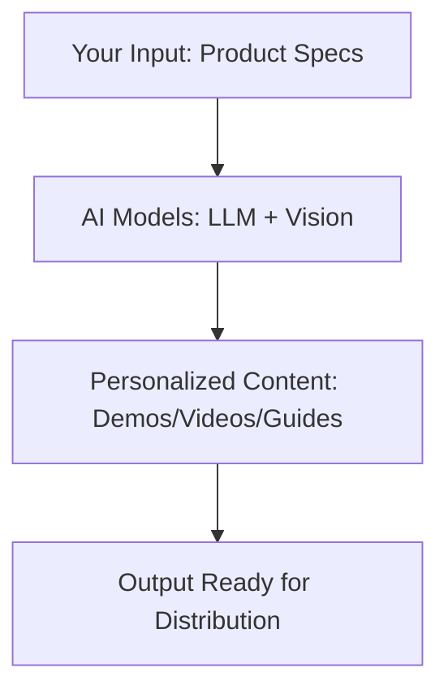

## Overview

Hexus transforms your product marketing with AI-powered tools that generate demos, videos, and guides at scale. You access core concepts like machine learning models for content creation, automation workflows, and analytics to measure engagement. This page explains these foundations so you build effective strategies.

<Columns cols={2}>
  <Card title="AI-Driven Generation" icon="zap" href="/docs/ai-generation">
    Create personalized content using advanced models.
  </Card>
  <Card title="Scalable Automation" icon="trending-up" href="/docs/automation">
    Automate workflows for teams of any size.
  </Card>
  <Card title="Customization Tools" icon="settings" href="/docs/customization">
    Tailor outputs to your brand voice.
  </Card>
  <Card title="Engagement Analytics" icon="bar-chart-3" href="/docs/metrics">
    Track performance with real-time insights.
  </Card>
</Columns>

## AI Content Generation Explained

Hexus uses large language models and computer vision to generate high-quality assets. You input product details, and the platform outputs demos, videos, or guides optimized for your audience.



<Callout kind="info">
  Hexus fine-tunes models on your data for outputs that match your brand tone and style.
</Callout>

<Steps>
  <Step title="Provide Inputs" icon="upload">
    Upload screenshots, API docs, or feature lists.
  </Step>
  <Step title="Select Template" icon="layout">
    Choose demo, video, or guide formats.
  </Step>
  <Step title="Generate Content" icon="zap">
    AI processes and creates assets in seconds.
  </Step>
  <Step title="Review and Iterate" icon="edit-3">
    Edit outputs with one-click refinements.
  </Step>
</Steps>

## Scalability and Automation

Scale content creation without adding headcount. Hexus automates repetitive tasks, handling thousands of variations for A/B testing or localization.

<Expandable title="Advanced Automation Workflow" default-open="false">
  Integrate Hexus into CI/CD pipelines for continuous content updates tied to product releases.
</Expandable>

## Customization Options

Tailor AI outputs with prompts, styles, and parameters. Use the SDK for programmatic control.

<Tabs>
  <Tab title="Dashboard" icon="monitor">
    Adjust sliders for tone, length, and visuals.
  </Tab>
  <Tab title="SDK Integration" icon="code">
    <CodeGroup tabs="JavaScript,Python">
```javascript
import { Hexus } from '@hexus/sdk';

const hexus = new Hexus({ apiKey: 'YOUR_API_KEY' });

const demo = await hexus.generateDemo({
  product: 'YourApp',
  features: ['auth', 'dashboard'],
  style: 'modern',
  audience: 'developers'
});
console.log(demo.url);
```
```python
from hexus import Hexus

hexus = Hexus(api_key="YOUR_API_KEY")

demo = hexus.generate_demo(
    product="YourApp",
    features=["auth", "dashboard"],
    style="modern",
    audience="developers"
)
print(demo.url)
```
    </CodeGroup>
  </Tab>
</Tabs>

## Engagement Metrics

Monitor how your AI-generated content performs. Hexus tracks views, interactions, and conversions.

| Metric          | Description                          | Target Benchmark |
|-----------------|--------------------------------------|------------------|
| View Completion | Percentage of video/guide watched    | `>80%`          |
| Engagement Rate | Clicks and shares per view           | `>5%`            |
| Conversion Lift | Increase in signups from content     | `+20%`           |

<Response tabs="Success,Low Engagement">
```json
{
  "views": 1500,
  "completions": 1250,
  "engagementRate": 7.2,
  "conversions": 45
}
```
```json
{
  "views": 1000,
  "completions": 400,
  "engagementRate": 2.1,
  "conversions": 5
}
```
</Response>

<Callout kind="tip">
  Use A/B testing in Hexus to optimize metrics by comparing AI variants.
</Callout>