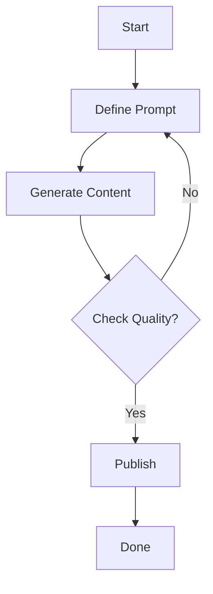

## Overview

Hexus empowers you to generate high-quality product content at scale using AI. Create interactive demos, polished videos, and comprehensive guides without manual design work. Follow these structured workflows to transform your content production.

<Columns cols={3}>
  <Card title="Demos" icon="zap" href="#demo-creation">
    Build interactive product demos in minutes.
  </Card>
  <Card title="Videos" icon="play-circle" href="#video-workflows">
    Generate engaging explainer videos automatically.
  </Card>
  <Card title="Guides" icon="book-open" href="#interactive-guides">
    Craft step-by-step user guides with AI assistance.
  </Card>
</Columns>

## Step-by-Step Demo Creation

Follow these steps to create a product demo showcasing key features.

<Steps>
  <Step title="Define Scope" icon="target">
    Specify your demo's focus, such as onboarding flows or feature highlights.

    Choose target audience and key interactions.
  </Step>
  <Step title="Generate Assets" icon="magic">
    Use Hexus AI to create screenshots and animations.

    ```javascript
    const demoConfig = {
      productUrl: "https://your-app.com",
      features: ["login", "dashboard", "analytics"],
      theme: "light"
    };
    const demo = await hexus.generateDemo(demoConfig);
    ```
  </Step>
  <Step title="Customize" icon="edit-3">
    Edit hotspots, tooltips, and transitions in the Hexus editor.
  </Step>
  <Step title="Publish" icon="upload-cloud">
    Export as embed code or shareable link.
  </Step>
</Steps>

<Callout kind="tip">
  Test your demo on multiple devices to ensure responsive behavior.
</Callout>

## Video Generation Workflows

Select a workflow based on your content needs.

<Tabs>
  <Tab title="Explainer" icon="film">
    Ideal for feature overviews.

    <Steps>
      <Step title="Input Script">
        Provide a script or let AI generate one.
      </Step>
      <Step title="Select Voice">
        Choose from 50+ AI voices.
      </Step>
    </Steps>

    ```bash
    hexus video:create --type explainer --script "Introduce our analytics dashboard"
    ```
  </Tab>
  <Tab title="Demo Recording" icon="video">
    Record screen with AI narration.

    Use screen capture integration for seamless workflows.
  </Tab>
  <Tab title="Tutorial" icon="graduation-cap">
    Step-by-step instructional videos.

    Customize pacing and add quizzes.
  </Tab>
</Tabs>

## Building Interactive Guides

Construct guides that users can follow at their own pace.

1. Outline your guide structure with headings and steps.
2. Integrate demos and videos using Hexus embeds.
3. Add interactive elements like quizzes and checklists.

```javascript
const guide = {
  title: "Getting Started with Hexus",
  steps: [
    { id: "1", content: "Sign up", demoId: "onboarding-demo" },
    { id: "2", content: "Create first project", videoId: "intro-video" }
  ]
};
```

Embed guides directly into your product or website.

## Optimizing AI Prompts

Craft precise prompts to get superior results from Hexus AI.

<CodeGroup tabs="Basic,Advanced">
  ```plaintext
  Generate a demo for user login flow.
  ```
  ```plaintext
  Create an interactive demo for the login screen in a SaaS dashboard app. Include tooltips explaining OAuth integration. Use modern UI with blue accents. Target audience: non-technical marketers. Duration: 90 seconds.
  ```
</CodeGroup>

<Callout kind="success">
  Include specifics like audience, style, and constraints for best outputs.
</Callout>

## Advanced Workflows

<Expandable title="Troubleshooting Common Issues" default-open="false">

If generation fails, check your API quota.

| Issue | Solution |
|-------|----------|
| Low quality output | Refine prompt with more details |
| Slow processing | Upgrade to Pro plan |
| Embed errors | Verify `YOUR_API_KEY` placement |

</Expandable>



Scale your content production with these practices and iterate based on user feedback.